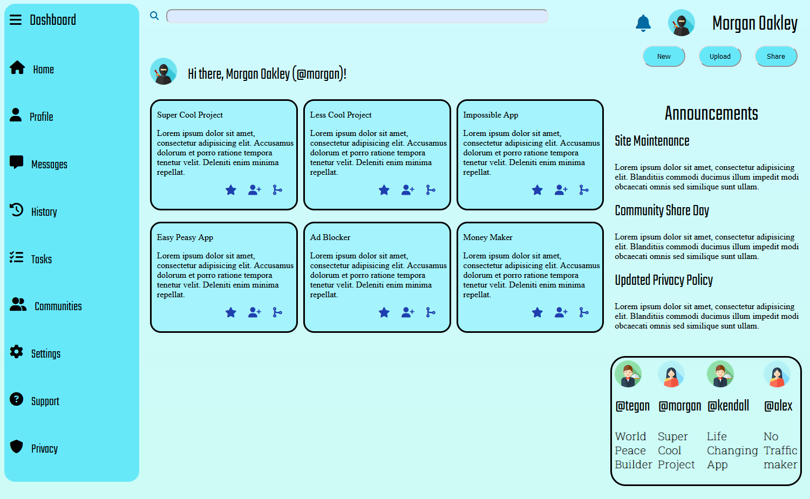
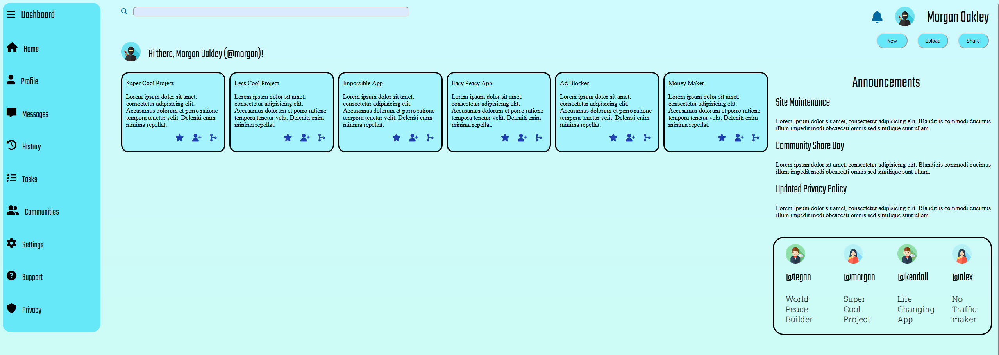

# Project Admin Dashboard

The goal of this repo is to practice the following skill sets:

- CSS
  - Nesting,
  - **Grid**: primary objective of this project
    - `grid-template-columns` & `grid-template-rows`
    - `grid-auto-rows`
    - Alignment: `justify-content`, `align-items`, `align-self`
- CSS Functions: `min`, `minmax` (Grid only),
- Basic CSS reset
- Chrome DevTools & Debugging
- Git Fundamentals

## Summary

CSS Grid was the main focus of this project. The `grid-template-columns: repeat(auto-fit, minmax(x, x))` property/value combination is super unique, giving us the opportunity to create responsive designs without media queries or JavaScript.

I struggled with the labels on the trending section where the users labels were going all around the place when resizing the window, I thought the flex property on the whole user would fix it but after a lot of testing I had to put an additional flex property solely on the label tag itself and it managed to fix it!


## Links

- [Live Demo](https://frenzy017.github.io/admin-dashboard/) / [Code](https://github.com/Frenzy017/admin-dashboard)

## Screenshots

> Normal View



> Wide View



## Deployment

```sh
git clone https://github.com/Frenzy017/admin-dashboard.git
```
